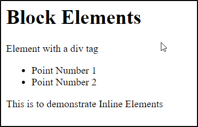

# HTML INLINE AND BLOCK ELEMENTS

HTML Elements are defined into two types:
1. Inline Elements
2. Block Elements
They define the default display property of the particular HTML element.

# Inline Elements
Inline Elements are those elements that occupy the space and width as what is required to them. An Inline Ekement does not start with a next line. 

Example of Inline Elements present in HTML are:<br>
`<a>`, `<span>`, `<input>`, `<audio>`, `<button>`, `<textarea>`, ``, `<select>` 

<h3>HTML Code to demonstrate Inline Elements</h3>

```html
<html>
    <head>
        <h1>Inline Elements</h1>
    </head>
    <body>
        <a href="youtube.com">Go to Youtube</a>
        <input type="text" placeholder="Enter your name"></input>
        <span>This is to demonstrate Inline Elements</span>
        <button>Submit</button>
    </body>
</html> 
```
    
<h3>Output</h3>


# Block Elements
Block Elements are those elements that occupies as much width as its parent element and as much height as needed by its content. A Block Element will start with a new line. 

Example of Block Elements present in HTML are:<br>
`<div>`, `<header>`, `<footer>`, `<form>`, `<p>`, `<ol>`, `<ul>`, `<li>`, `<table>`

```html
<h3>HTML Code to demonstrate Block Elements</h3>
<html>
    <head>
        <h1>Block Elements</h1>
    </head>
    <body>
        <div>Element with a div tag</div>
        <ul>
            <li>Point Number 1</li>
            <li>Point Number 2</li>
        </ul>
        <p>This is to demonstrate Inline Elements</p>
    </body>
</html> 
```

<h3>Output</h3>


